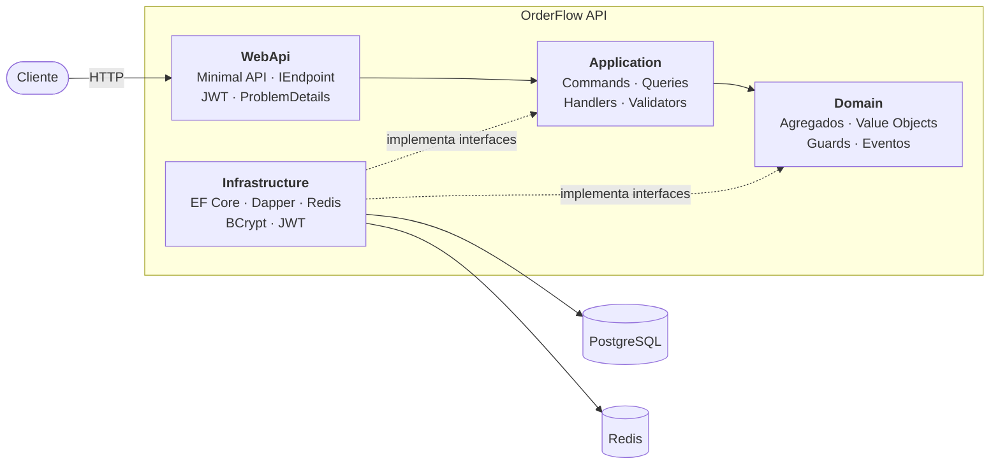
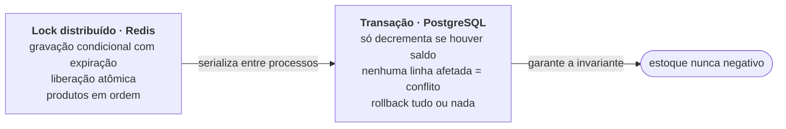
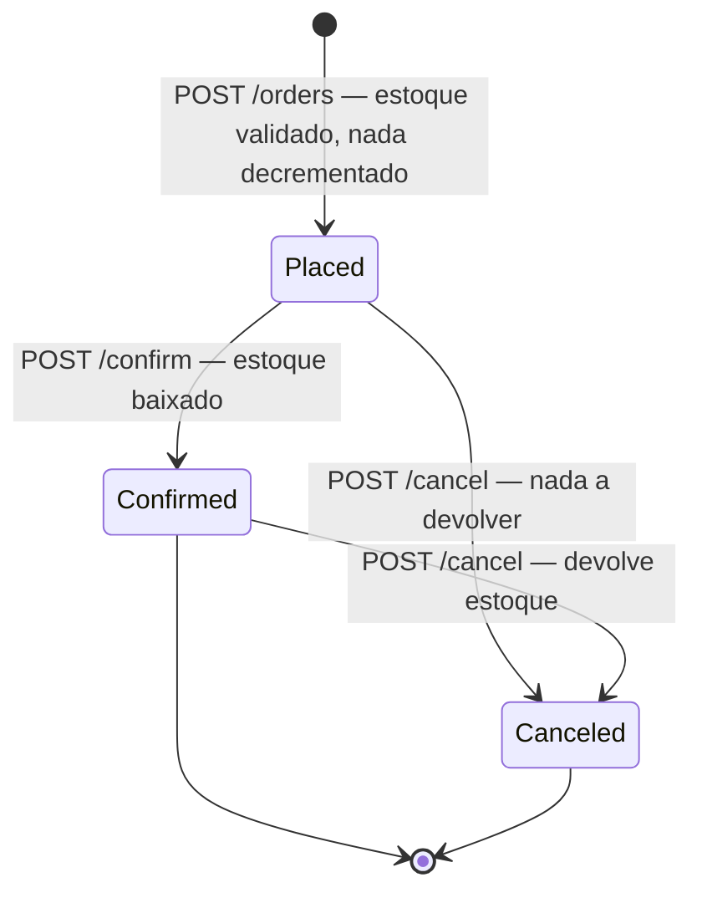

# OrderFlow API

[](https://dotnet.microsoft.com/)
[](https://learn.microsoft.com/ef/core/)
[](https://github.com/DapperLib/Dapper)
[](https://www.postgresql.org/)
[](https://redis.io/)
[](./docker-compose.yml)
[](./LICENSE)

API de pedidos em .NET 10, construída em torno de uma invariante crítica: **o estoque nunca pode ficar negativo, nem sob pedidos concorrentes, nem com múltiplas instâncias da API.**


1. [Início rápido](#início-rápido)
2. [Arquitetura](#arquitetura) 
3. [Stack](#stack)
4. [Concorrência](#o-problema-central-concorrência-de-estoque)
5. [Endpoints](#endpoints)
6. [Testes](#testes)
7. [Documentação](#documentação)


## Início rápido

Requer apenas **Docker Desktop**:

```bash
git clone https://github.com/barbarapac/order-flow-api.git
cd order-flow-api
docker compose up --build
```

Sobe PostgreSQL, Redis e a API, com o schema criado automaticamente no startup.

| | Acesse                        |
|---|-------------------------------|
| **Swagger UI** | http://localhost:8080/swagger |
| **API** | http://localhost:8080         |

Para derrubar: `docker compose down`, ou `docker compose down -v` para apagar também o volume do banco.

<details>
<summary><b>Rodando a API fora do Docker</b></summary>

Requer o .NET 10 SDK. Suba só a infraestrutura e rode a API localmente:

```bash
docker compose up postgres redis -d
dotnet run --project src/OrderFlow.WebApi
```

A connection string e a chave JWT de desenvolvimento já estão em
`src/OrderFlow.WebApi/appsettings.Development.json` — valores de uso local, não são segredos reais.

</details>

<details>
<summary><b>Fluxo completo em curl</b></summary>

```bash
BASE=http://localhost:8080

# 1. Cadastro
curl -s -X POST $BASE/users \
  -H "Content-Type: application/json" \
  -d '{"name":"Jane Doe","email":"jane@example.com","password":"S3cret123"}'

# 2. Login — guarda o JWT
TOKEN=$(curl -s -X POST $BASE/auth/token \
  -H "Content-Type: application/json" \
  -d '{"email":"jane@example.com","password":"S3cret123"}' | jq -r .token)

# 3. Criar um produto com 10 unidades em estoque
PRODUCT_ID=$(curl -s -X POST $BASE/products \
  -H "Authorization: Bearer $TOKEN" -H "Content-Type: application/json" \
  -d '{"name":"Teclado mecânico","unitPrice":350.00,"availableQuantity":10}' | jq -r .id)

# 4. Criar um pedido de 2 unidades — estoque é validado, mas ainda não baixado
ORDER_ID=$(curl -s -X POST $BASE/orders \
  -H "Authorization: Bearer $TOKEN" -H "Content-Type: application/json" \
  -d "{\"currency\":\"BRL\",\"items\":[{\"productId\":\"$PRODUCT_ID\",\"quantity\":2}]}" | jq -r .id)

# 5. Confirmar — agora sim baixa 2 unidades (10 → 8)
curl -s -X POST $BASE/orders/$ORDER_ID/confirm -H "Authorization: Bearer $TOKEN"

# 6. Cancelar — devolve as 2 unidades (8 → 10), porque o pedido estava Confirmed
curl -s -X POST $BASE/orders/$ORDER_ID/cancel -H "Authorization: Bearer $TOKEN"
```

</details>

## Arquitetura

Quatro projetos com dependência em uma única direção, cada um organizado internamente por **feature**. Não
existe pasta `Controllers/` ou `Services/`: existe `Orders/Confirm/`, com o Command, o Handler e o Response lado
a lado.


> Para mais detalhes, acesse: [`docs/architecture.md`](docs/architecture.md) · [`docs/domain-model.md`](docs/domain-model.md)

## Stack

| Camada | Tecnologia | Por quê |
|---|---|---|
| Runtime | .NET 10 · ASP.NET Core Minimal API | — |
| Escrita | EF Core 10 + Npgsql | change tracking, transações, migrations |
| Leitura | Dapper | SQL explícito, projeção direta no DTO ([ADR-014](docs/decisions/014-dapper-read-side.md)) |
| CQRS | `Mediator` (source generator) | despacho resolvido em compilação — **não** é MediatR ([ADR-003](docs/decisions/003-cqrs-mediator.md)) |
| Validação | FluentValidation | roda no pipeline, antes de qualquer handler |
| Autenticação | JWT Bearer + BCrypt.Net | — |
| Concorrência | StackExchange.Redis | lock distribuído, implementação manual ([ADR-007](docs/decisions/007-lock-distribuido-redis.md)) |
| Erros | `ProblemDetails` (RFC 7807) | ponto único de tradução ([ADR-013](docs/decisions/013-iexceptionhandler-tabela-errortype.md)) |
| Documentação | Swashbuckle (OpenAPI) | — |
| Testes | xUnit · FluentAssertions · Moq · AutoBogus | — |

## O problema central: concorrência de estoque

O estoque é **validado** na criação do pedido e **baixado** apenas na confirmação
([ADR-005](docs/decisions/005-baixa-estoque-na-confirmacao.md)). A confirmação é, portanto, a região crítica.

Com um produto de 5 unidades e dois pedidos de 4 confirmando ao mesmo tempo, ler o saldo e depois escrever o
novo valor deixaria as duas requisições lerem `5`, ambas concluírem que há estoque, e o resultado seria `-3`. Um
`lock` em memória não resolve: com várias instâncias atrás de um load balancer, cada processo tem o seu.

A solução combina dois mecanismos com papéis distintos:



Quem **garante** a não-negatividade é o banco: a condição vive dentro do próprio update, então não existe janela
entre ler e escrever. O lock distribuído **coordena** as instâncias antes que cheguem ao banco, reduzindo
contenção e trabalho descartado. Se o Redis cair, a invariante continua protegida — o que se perde é a
serialização antecipada, não a consistência.

Pedidos com vários produtos adquirem os locks sempre na mesma ordem, para evitar deadlock. Falta de estoque em
qualquer item derruba a transação inteira: não há baixa parcial.

→ [`docs/concurrency.md`](docs/concurrency.md) — o fluxo completo, as alternativas descartadas e os limites
conhecidos

## Ciclo de vida do pedido



Confirmar e cancelar são idempotentes: repetir a chamada devolve `200` sem efeito colateral. Transições
realmente inválidas, confirmar um pedido cancelado, retornam `409`.

## Endpoints

| Método | Rota | Auth | Descrição |
|---|---|:---:|---|
| `POST` | `/users` | — | Cadastra um usuário |
| `POST` | `/auth/token` | — | Autentica e devolve o JWT |
| `POST` | `/products` | 🔒 | Cria um produto |
| `GET` | `/products` | 🔒 | Lista produtos (paginado) |
| `GET` | `/products/{id}` | 🔒 | Busca um produto |
| `PUT` | `/products/{id}` | 🔒 | Atualiza um produto |
| `DELETE` | `/products/{id}` | 🔒 | Remove um produto |
| `POST` | `/orders` | 🔒 | Cria um pedido (`Placed`) |
| `GET` | `/orders` | 🔒 | Lista os pedidos do usuário (paginado, filtro por `status`) |
| `GET` | `/orders/{id}` | 🔒 | Busca um pedido do usuário |
| `POST` | `/orders/{id}/confirm` | 🔒 | Confirma o pedido — **baixa o estoque** |
| `POST` | `/orders/{id}/cancel` | 🔒 | Cancela o pedido — devolve o estoque se já confirmado |

> Para autenticar, cadastre-se em `/users`, pegue o token em `/auth/token` e envie
`Authorization: Bearer {token}` no Swagger, pelo botão **Authorize**. O token vale 60 minutos
([ADR-011](docs/decisions/011-jwt-60-minutos.md)). Não há distinção de papéis nesta versão: qualquer usuário
autenticado gerencia o catálogo, mas cada um só enxerga os próprios pedidos. O cliente do pedido nunca vem no
payload é sempre derivado do token ([ADR-004](docs/decisions/004-sem-entidade-customer.md)).

## Configuração

Lida de `appsettings.json` ou de variáveis de ambiente no formato `Seção__Chave`:

| Chave | Descrição | Valor em desenvolvimento |
|---|---|---|
| `ConnectionStrings:OrderFlowDb` | Connection string do PostgreSQL | `Host=localhost;Port=5432;Database=orderflow;...` |
| `ConnectionStrings:Redis` | Endpoint do Redis | `localhost:6379` |
| `Jwt:Issuer` | Emissor do token | `OrderFlow.Api` |
| `Jwt:Audience` | Audiência do token | `OrderFlow.Client` |
| `Jwt:SigningKey` | Chave HMAC de assinatura | chave de dev — **trocar em produção** |
| `Jwt:ExpirationMinutes` | Validade do token | `60` |
| `ApplyMigrationsOnStartup` | Aplica migrations no boot | `true` ([ADR-012](docs/decisions/012-migrations-automaticas.md)) |

## Testes

```bash
dotnet test                                           # todos
dotnet test --filter "FullyQualifiedName~OrderTests"  # um arquivo
```

## Estrutura do projeto

```text
src/
├── OrderFlow.Domain/          # agregados, Value Objects, Guards, eventos — sem dependências externas
├── OrderFlow.Application/     # casos de uso, um por pasta: Command/Query + Handler + Validator
├── OrderFlow.Infrastructure/  # EF Core, Dapper, Redis, JWT, BCrypt
└── OrderFlow.WebApi/          # endpoints e composição da aplicação
test/OrderFlow.UnitTest/       # espelha a estrutura de src/
docs/                          # documentação de arquitetura e ADRs
```

## Documentação

Este README cobre o uso. O porquê de cada decisão está documentado à parte:

| Documento | Conteúdo |
|---|---|
| [`docs/architecture.md`](docs/architecture.md) | Camadas, Vertical Slice, caminho da requisição, escrita e leitura |
| [`docs/domain-model.md`](docs/domain-model.md) | Agregados, invariantes, máquina de estados, eventos |
| [`docs/concurrency.md`](docs/concurrency.md) | O problema de estoque, as duas camadas de proteção, alternativas e limites |
| [`docs/error-handling.md`](docs/error-handling.md) | Taxonomia de erros, `ProblemDetails`, códigos e exemplos |
| [`docs/decisions/`](docs/decisions/) | 14 ADRs — contexto, alternativas, decisão e consequências |

## Licença

[MIT](./LICENSE)
