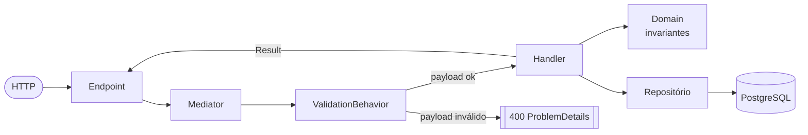

# Arquitetura

Como a solução é organizada: as camadas, a organização interna por feature, o caminho de uma requisição e a
separação entre escrita e leitura.

## Camadas

São quatro projetos, com as referências apontando numa única direção:

```text
Domain  ←  Application  ←  Infrastructure  ←  WebApi
```

| Projeto | Responsabilidade |
|---|---|
| `OrderFlow.Domain` | Agregados, Value Objects, Guards, eventos e os tipos base de erro. Não depende de nada. |
| `OrderFlow.Application` | Casos de uso — Commands, Queries, Handlers, Validators — e os contratos de infraestrutura. |
| `OrderFlow.Infrastructure` | EF Core, Dapper, Redis, BCrypt e JWT. Implementa os contratos declarados acima. |
| `OrderFlow.WebApi` | Exposição HTTP: endpoints, autenticação, `ProblemDetails` e Swagger. |

O que mantém isso honesto é a inversão de dependência. As interfaces de repositório são declaradas no `Domain`;
as de lock distribuído, execução de query, unidade de trabalho, hash de senha e geração de token, na
`Application`. Todas são implementadas na `Infrastructure`. O `Domain` não conhece EF Core, Redis nem
ASP.NET Core.

Existe uma exceção consciente: o `Domain` referencia `Mediator.Abstractions`, porque os eventos de domínio são
notificações do mediador. É acoplamento a uma abstração de mensageria em processo, não a infraestrutura. A
alternativa seria uma interface própria mais um adaptador — custo que não se paga no escopo atual.

Cada camada expõe um único método de extensão de registro (`AddApplication`, `AddInfrastructure`, `AddWebApi`),
chamado no `Program.cs`.

## Vertical Slice dentro de cada camada

A pasta de primeiro nível dentro de cada projeto é a **feature**, não o tipo técnico. Não existe `Controllers/`,
`Services/` ou `Handlers/` agrupando coisas não relacionadas ([ADR-010](./decisions/010-vertical-slice.md)).

```text
OrderFlow.Application/
├── Auth/Login/
├── Users/Register/
├── Products/
│   ├── Create/  Update/  Delete/  GetById/  GetAll/
│   ├── OrderConfirmed/          ← reage ao evento: baixa estoque
│   └── OrderCanceled/           ← reage ao evento: devolve estoque
├── Orders/
│   └── Create/  Confirm/  Cancel/  GetById/  GetAll/
└── _Shared/                     ← contratos e comportamentos transversais
```

Dentro de `Orders/Confirm/` ficam lado a lado o Command, o Handler e o Response. Tudo o que é genuinamente
transversal vai para o `_Shared/` da própria camada; o prefixo `_` mantém a pasta no topo da listagem e deixa
claro que ela não é uma feature.

O trade-off: mudar uma feature de ponta a ponta toca uma pasta por camada, mas comparar dois handlers parecidos
exige abrir pastas diferentes.

## Registro de endpoints

Endpoints não são mapeados à mão no `Program.cs`. Cada um implementa a interface `IEndpoint`, que expõe um único
método de mapeamento. No startup, todas as implementações são descobertas por reflection e registradas.

Na prática: **adicionar um endpoint novo é criar uma classe na pasta da feature.** O `Program.cs` não muda.

## O caminho de uma requisição



1. O **endpoint** só traduz HTTP em Command ou Query — inclusive extraindo o `CustomerId` do claim do JWT — e o
   resultado de volta em resposta HTTP. Não tem regra de negócio.
2. O **`ValidationBehavior`** roda antes de qualquer handler. Se o payload é inválido, nada toca domínio nem
   banco: é o *fastfail*.
3. O **handler** orquestra — carrega agregados, chama o comportamento de domínio, persiste, publica eventos.
4. O **domínio** garante as invariantes e falha imediatamente quando alguma é violada.

Uma nota sobre a biblioteca: `Mediator` aqui é o pacote de Martin Othamar, baseado em source generator, e não o
MediatR. O despacho é resolvido em tempo de compilação, sem reflection em runtime. Em troca, os pipeline
behaviors precisam ser registrados explicitamente, porque essa lib não faz assembly scan para eles
([ADR-003](./decisions/003-cqrs-mediator.md)).

## Escrita e leitura por caminhos diferentes

A separação CQRS aqui é **lógica**: um único banco PostgreSQL, sem read model replicado e sem consistência
eventual.

| | Escrita | Leitura |
|---|---|---|
| Contrato | `ICommand<TResponse>` | `IQuery<TResponse>` |
| Acesso a dados | EF Core + Npgsql | Dapper, via `IQueryExecutor` |
| Motivo | change tracking, transações, migrations | SQL explícito, projeção direta no DTO, sem tracking |

As queries de leitura são pass-through: buscam dado e devolvem, sem regra de negócio no meio. Não precisam de
identity map nem change tracking, então usam Dapper e projetam direto para o objeto de resposta
([ADR-014](./decisions/014-dapper-read-side.md)). O `IQueryExecutor` abstrai a conexão, o que mantém os handlers
de Query testáveis sem banco.

Se um dia houver requisito real de escala de leitura, o read model pode ser separado fisicamente sem tocar nos
Commands. Antecipar isso agora custaria consistência eventual sem benefício.

## Persistência

- **IDs** são `Guid` gerados em memória, não pelo banco: o agregado nasce completo, sem round-trip
  ([ADR-001](./decisions/001-ids-guid.md)).
- **Migrations** são aplicadas no startup quando a flag de configuração está ligada — conveniente para o
  ambiente do desafio, com as ressalvas de produção em [ADR-012](./decisions/012-migrations-automaticas.md).
- **Transações** são explícitas, controladas pelo `IUnitOfWork` nos fluxos de confirmação e cancelamento.
- Os detalhes de mapeamento dos agregados estão em [`domain-model.md`](./domain-model.md#persistência).

## Onde cada preocupação vive

| Preocupação | Camada | Mecanismo |
|---|---|---|
| Formato do payload | Application | FluentValidation no `ValidationBehavior` |
| Invariante de agregado | Domain | Guard Clauses e exception de domínio |
| "Não encontrado" e orquestração | Application | `Result<T>` com falha |
| Identidade de quem chama | WebApi | JWT Bearer; o `CustomerId` vem do claim |
| Concorrência de estoque | Application + Infrastructure | lock distribuído e update condicional |
| Tradução de erro para HTTP | WebApi | handler global de exception |

Cada uma é detalhada em [`domain-model.md`](./domain-model.md), [`concurrency.md`](./concurrency.md) e
[`error-handling.md`](./error-handling.md).
