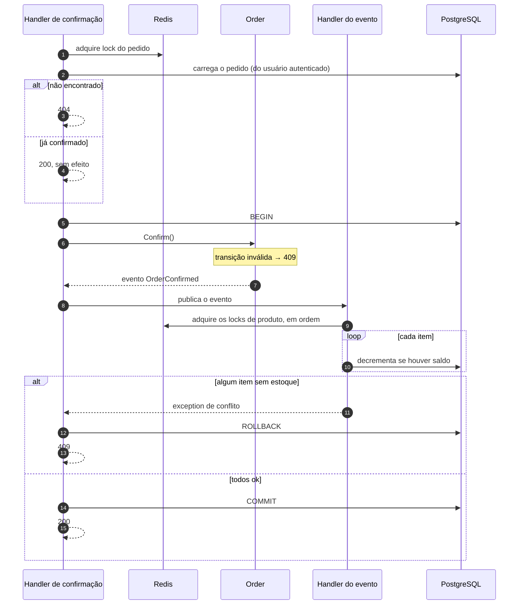

# Concorrência e consistência de estoque

Este é o problema central do OrderFlow. O domínio é pequeno de propósito; a complexidade real está em uma única
invariante:

> **A quantidade disponível nunca pode ficar negativa, nem com pedidos concorrentes disputando o mesmo produto,
> nem com várias instâncias da API rodando ao mesmo tempo.**

## O problema

A confirmação do pedido é a região crítica: é o único ponto onde o estoque é decrementado.

Imagine um produto com 5 unidades e dois pedidos de 4 confirmando simultaneamente:

```text
Produto A · disponível = 5

t0   Requisição 1: lê 5        Requisição 2: lê 5
t1   5 >= 4 ✔                  5 >= 4 ✔
t2   escreve 5 - 4 = 1         escreve 5 - 4 = 1     ← ou 1 - 4 = -3
```

Ambas leem 5, ambas concluem que há estoque, e o resultado é estoque negativo ou uma baixa perdida. Ler e depois
escrever em comandos separados é sempre vulnerável a isso — existe uma janela entre as duas operações.

O agravante é que a API roda com múltiplas instâncias. Um `lock` de C# resolveria apenas dentro de um processo:
duas réplicas atrás de um load balancer têm objetos de lock diferentes e entram na região crítica juntas.

## A solução: duas camadas com papéis distintos

```text
Update condicional + transação  →  garante a não-negatividade no banco
Lock distribuído (Redis)        →  serializa a região crítica entre processos
```

Elas não são redundantes, e a distinção importa: **quem garante a invariante é o banco.** O lock só coordena.

### O que garante: update condicional dentro de transação

A condição de estoque vive na própria cláusula `WHERE` do update — só decrementa se a quantidade disponível
ainda for suficiente. Isso tem duas propriedades importantes:

- **Não há leitura prévia.** O valor novo é derivado do valor atual pelo próprio banco, sob o lock de linha do
  PostgreSQL. Não existe janela entre ler e escrever.
- **O número de linhas afetadas é a resposta.** Zero significa que a condição não valia mais, ou seja, estoque
  insuficiente — e o handler lança uma exception de conflito de propósito, para abortar a transação em
  andamento.

Um pedido com vários itens em que só o terceiro falta estoque não deixa os dois primeiros decrementados: a
transação sofre rollback e nada é persistido, nem a baixa parcial nem a mudança de status do pedido.

Vale registrar com clareza: **se o Redis cair, a invariante continua protegida.** O que se perde é a
serialização antecipada, não a consistência.

### O que coordena: lock distribuído no Redis

O lock organiza as instâncias antes que elas cheguem ao banco. São dois locks, com propósitos diferentes:

| Recurso | Adquirido em | Protege |
|---|---|---|
| `order:{id}:status` | Confirmação e cancelamento | A sequência ler-decidir-escrever do estado do pedido — é o que torna a idempotência confiável |
| `product:{id}:stock` | Handlers dos eventos de estoque | A região crítica de ajuste de estoque de cada produto |

A implementação é manual sobre os primitivos do Redis, e há dois detalhes que costumam ser feitos errado:

**A liberação é atômica.** Ler o dono do lock e depois apagá-lo em dois comandos separados não é seguro: entre
um e outro o lock pode expirar e ser readquirido, e a remoção apagaria o lock alheio. Aqui a liberação roda como
um script único no Redis, que só apaga a chave se o valor guardado ainda for o token daquela aquisição.

**Os locks são adquiridos em ordem determinística.** Um pedido com vários produtos precisa de vários locks. Se
dois pedidos disputassem os mesmos dois produtos em ordens opostas, teríamos deadlock clássico — um segurando o
que o outro espera. Ordenar os produtos por Id antes de adquirir elimina isso: o segundo pedido apenas espera. A
liberação acontece sempre, mesmo em caso de falha no meio do caminho.

## O fluxo completo da confirmação



A ordem importa: o lock do pedido é adquirido **antes** de carregá-lo, de modo que a decisão "já está
confirmado?" e a escrita do novo estado aconteçam dentro da mesma região crítica. Sem isso, uma confirmação e um
cancelamento simultâneos poderiam ambos ler o pedido como `Placed` e ambos seguir adiante.

O cancelamento segue exatamente a mesma forma, devolvendo estoque em vez de baixar — sem condição no update,
porque devolver nunca falha por indisponibilidade — e só quando o pedido estava confirmado.

## Por que manter as duas camadas

Se o update condicional já garante a invariante, por que o Redis?

Sem lock, cada corrida perdida vira um `409` e uma transação revertida; sob alta contenção, muito trabalho é
jogado fora. O lock serializa cedo e reduz a pressão no banco.

E o contrário — só lock, sem update condicional — seria simplesmente incorreto. Se o lock expira enquanto o
processo ainda trabalha, dois processos entram na região crítica e o estoque fica negativo. Nenhum lock
distribuído, Redlock incluído, oferece garantia de exclusão mútua sob pausa de GC, falha de rede ou clock skew.
Tratar infraestrutura de coordenação como mecanismo de consistência é exatamente o erro que essa separação
evita.

## Alternativas consideradas

| Estratégia | Por que não aqui |
|---|---|
| `lock` em memória | Não funciona com múltiplas instâncias — é justamente o cenário que motivou o lock distribuído. |
| Concorrência otimista por versão de linha | Boa para baixa contenção. No produto disputado, todo mundo colide e o cliente vira responsável por retentar. O update condicional entrega o mesmo resultado sem round-trip de leitura. |
| `SELECT ... FOR UPDATE` | Funciona bem em banco único, mas o update condicional dá a mesma garantia com um comando a menos — o lock de linha vem implícito. |
| Reserva de estoque na criação | Exige TTL de reserva, processo de expiração e mais estado. Complexidade desproporcional ao escopo ([ADR-005](./decisions/005-baixa-estoque-na-confirmacao.md)). |
| Fila com processamento serializado por produto | Elimina contenção e escala bem, mas troca a resposta síncrona por consistência eventual: o cliente deixa de saber, na resposta, se o pedido foi confirmado. |
| Redlock multi-nó | O ganho de disponibilidade não se justifica com uma única instância de Redis, e não altera a garantia de correção — que vem do banco. |

## Limitações conhecidas

Assumidas conscientemente para o escopo deste projeto:

- **O lock expira em 30 segundos, valor fixo.** Uma operação mais lenta que isso perde o lock sem saber; não há
  fencing token nem renovação. A correção não depende disso, mas a serialização se perde.
- **A espera pelo lock é por polling, a cada 50ms, sem timeout máximo.** Sob contenção alta há espera ativa
  contra o Redis, e uma requisição pode esperar indefinidamente — na prática limitada pelo timeout do cliente
  HTTP, cujo cancelamento é propagado até a espera.
- **O Redis é ponto único de falha para latência, não para correção.** Sem ele, as confirmações passam a
  competir direto no banco e o excedente recebe `409`.
- **Não há métricas.** Contenção de lock, tempo de espera e taxa de conflito de estoque não são observáveis
  hoje. Seriam os primeiros sinais a instrumentar em produção.
- **Os eventos são publicados em processo, dentro da transação.** É o que garante consistência entre o estado do
  pedido e o estoque. Se um dia precisassem sair para outro serviço, o padrão correto passaria a ser Outbox —
  publicar direto num broker dentro da transação reintroduziria o problema que a transação resolve.

Os cenários acima são cobertos por testes: idempotência de confirmação e cancelamento, estoque insuficiente
abortando a transação, falha parcial em pedido multi-item, ordem de aquisição e liberação de locks, e liberação
apenas pelo dono do lock.

## Decisões relacionadas

[ADR-005](./decisions/005-baixa-estoque-na-confirmacao.md) — quando o estoque é baixado ·
[ADR-006](./decisions/006-update-condicional-transacional.md) — o update condicional ·
[ADR-007](./decisions/007-lock-distribuido-redis.md) — o lock distribuído
