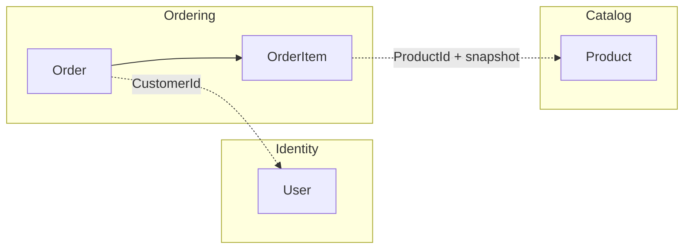
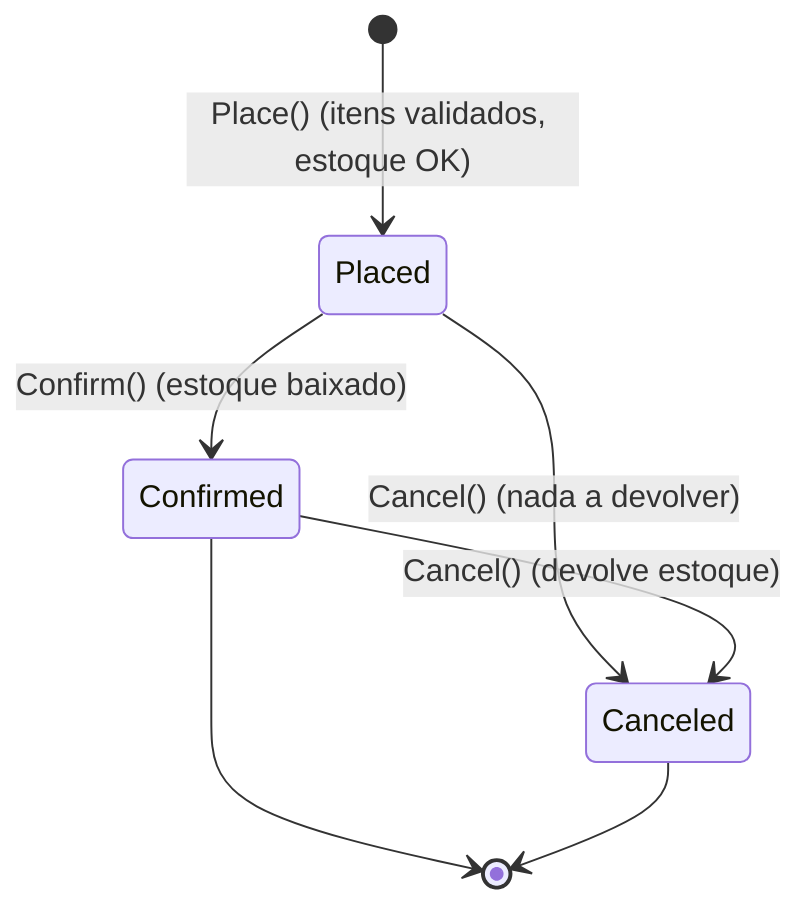
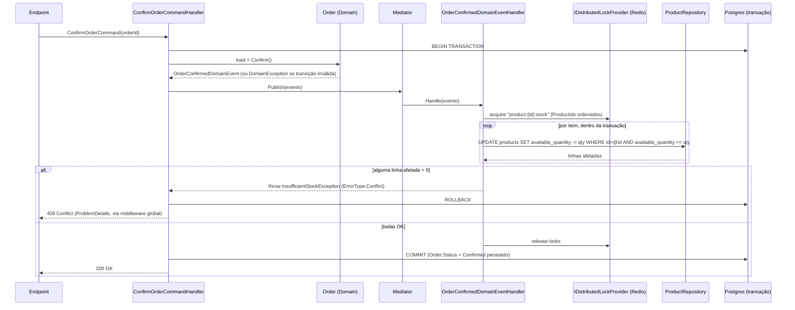

# Modelagem de Domínio — OrderFlow

> Documento vivo, atualizado conforme o domínio evolui durante o desafio.
> Para o histórico de decisões e trade-offs, ver [`decisions.md`](./decisions.md).
> Para o detalhamento de tratamento de erro e `ProblemDetails`, ver [`error-handling.md`](./error-handling.md).

**Nota de idioma**: o texto deste documento está em português. Os nomes de entidades, propriedades e métodos no
código (`Order`, `Product`, `User`, `Place`, `Confirm`, `Cancel`...) ficam em **inglês**, seguindo a linguagem
ubíqua que o próprio enunciado do desafio já define — ver [ADR-002](./decisions.md#adr-002).

## 1. Bounded contexts

O domínio proposto pelo desafio (Produto, Pedido, Usuário) foi modelado como **três agregados dentro de um único
serviço** (não há necessidade de separar em microsserviços para o escopo do teste), mas com fronteiras de
consistência bem definidas — cada agregado só referencia o outro por Id, nunca por navegação de objeto:



- **Identity**: quem acessa a API (`User`).
- **Catalog**: o que pode ser vendido (`Product`), CRUD simples e **domínio anêmico** (exigência explícita do
  enunciado).
- **Ordering**: o núcleo do domínio — `Order` é o agregado raiz, `OrderItem` é entidade filha (não tem
  repositório próprio, só existe dentro de um `Order`).

## 2. Linguagem ubíqua

| Termo       | Significado                                                                       |
|-------------|-------------------------------------------------------------------------------------|
| `User`      | Conta que autentica na API. É também o "cliente" que cria pedidos.                 |
| `Product`   | Item de catálogo, com preço e quantidade disponível em estoque.                    |
| `Order`     | Pedido feito por um `User`, com um ou mais itens, em uma única `Currency`.          |
| `OrderItem` | Linha do pedido: produto, quantidade e preço unitário **congelado** na criação.    |
| `Placed`    | Pedido criado e validado (itens, estoque disponível). Estado inicial.              |
| `Confirmed` | Pedido teve o estoque efetivamente baixado.                                        |
| `Canceled`  | Pedido cancelado; se estava `Confirmed`, o estoque reservado é devolvido.           |

## 3. Shared Kernel

Peças técnicas genéricas do padrão tático DDD, reaproveitadas pelos três agregados, em
`OrderFlow.Domain/SharedKernel`:

```csharp
public abstract class Entity<TId> : IEquatable<Entity<TId>> where TId : notnull
{
    public TId Id { get; protected init; } = default!;
    // Equals/GetHashCode por Id
}

public abstract class AggregateRoot<TId> : Entity<TId> where TId : notnull
{
    private readonly List<DomainEvent> _domainEvents = [];
    public IReadOnlyCollection<DomainEvent> DomainEvents => _domainEvents.AsReadOnly();

    protected void Raise(DomainEvent @event) => _domainEvents.Add(@event);
    public void ClearDomainEvents() => _domainEvents.Clear();
}

public abstract record DomainEvent : INotification
{
    public DateTime OccurredOnUtc { get; init; }
}

public enum ErrorType { Validation, NotFound, Conflict, BusinessRule }

/// Base de qualquer exception que carrega um Code (legível por máquina) + ErrorType,
/// permitindo que um único handler global traduza para ProblemDetails sem conhecer
/// cada tipo concreto. Detalhe completo em error-handling.md.
public abstract class AppException(string code, string message, ErrorType type) : Exception(message)
{
    public string Code { get; } = code;
    public ErrorType Type { get; } = type;
}

/// Lançada pelos Guards dentro do Domain quando uma invariante de agregado é violada
/// (construção ou transição de estado inválida).
public sealed class DomainException(string code, string message, ErrorType type = ErrorType.BusinessRule)
    : AppException(code, message, type);
```

`Result<T>` continua existindo, mas com escopo reduzido: só para outcomes de **orquestração na Application** que
o Domain não tem como saber (ex.: "esse Id não existe no repositório"). Ver ADR-007 para o racional completo da
divisão Guard+Exception (Domain) vs. `Result<T>` (Application).

```csharp
public sealed record Error(string Code, string Message, ErrorType Type);

public class Result<T>
{
    public bool IsSuccess { get; }
    public Error? Error { get; }
    public T? Value { get; }
    // Result.Success(value) / Result.Failure<T>(error)
}
```

### Guard Clauses

Cada agregado com invariante real (`User`, `Order`) tem uma classe estática de guards, chamada logo no início de
construtores/factories/métodos de transição — falha rápido, sem deixar o objeto existir em estado inválido:

```csharp
internal static class ProductGuard
{
    public static void NameIsValid(string name)
    {
        if (string.IsNullOrWhiteSpace(name))
            throw new DomainException("product.invalid_name", "Product name cannot be empty.", ErrorType.Validation);
    }
}
```

> `Product` é citado aqui só como exemplo do padrão — na prática **`Product` não usa Guard** (ver seção 5): por
> ser anêmico por exigência do enunciado, a validação dele fica inteira na Application (FluentValidation), não no
> Domain. Guards valem para `User` e `Order`/`OrderItem`, que são os agregados ricos.

## 4. Agregado `User` (Identity)

```csharp
public sealed class User : AggregateRoot<Guid>
{
    public string Name { get; private set; }
    public Email Email { get; private set; }           // Value Object
    public string PasswordHash { get; private set; }    // opaco — hashing é responsabilidade da Infrastructure
    public UserRole Role { get; private set; }           // Customer | Admin
    public DateTime CreatedAtUtc { get; private set; }

    public static User Register(string name, string emailRaw, string passwordHash, UserRole role = UserRole.Customer)
    {
        UserGuard.NameIsValid(name);
        return new User(name, new Email(emailRaw), passwordHash, role);
        // new Email(emailRaw) já valida formato e lança DomainException se inválido
    }
}
```

- **Value Object `Email`**: valida formato no construtor (lança `DomainException` se inválido) e normaliza
  (`trim` + `lowercase`). Igualdade estrutural.
- **Guard no Domain**: só o que o próprio agregado consegue avaliar sozinho (nome não vazio, formato de e-mail).
  A **política de senha** (tamanho mínimo, complexidade) é validada em `Application` (FluentValidation) sobre a
  senha em texto puro, **antes** do hash — o Domain nunca vê a senha em texto puro, só recebe o hash já pronto
  (`IPasswordHasher` fica na Infrastructure).
- **`Role`**: usado para autorização básica (`[Authorize(Roles = "Admin")]` em endpoints de gestão de catálogo).
- **Sem método de "verificar senha" no domínio**: comparação de hash é preocupação de infraestrutura
  (`IPasswordHasher.Verify(plainPassword, hash)`), chamada pelo handler de login.

## 5. Agregado `Product` (Catalog) — anêmico por exigência do enunciado

```csharp
public sealed class Product : AggregateRoot<Guid>
{
    public string Name { get; set; }
    public decimal UnitPrice { get; set; }
    public int AvailableQuantity { get; set; }
    public DateTime CreatedAtUtc { get; private init; }
}
```

- Sem métodos de negócio, sem Guards, sem eventos. CRUD tratado inteiramente pela Application (validação via
  FluentValidation: preço > 0, quantidade >= 0, nome obrigatório).
- A baixa/devolução de estoque **não** passa por este objeto em memória — é feita por um `UPDATE` condicional
  direto no repositório (ver seção 7), justamente para não "vazar" regra de concorrência para uma entidade que o
  enunciado pede explicitamente que seja simples.

## 6. Agregado `Order` (Ordering) — rico

```csharp
public sealed class Order : AggregateRoot<Guid>
{
    public Guid CustomerId { get; private set; }        // = Id do User autenticado
    public Currency Currency { get; private set; }        // Value Object (ISO 4217, 3 letras)
    public OrderStatus Status { get; private set; }
    public DateTime CreatedAtUtc { get; private set; }
    public DateTime? ConfirmedAtUtc { get; private set; }
    public DateTime? CanceledAtUtc { get; private set; }

    private readonly List<OrderItem> _items = [];
    public IReadOnlyCollection<OrderItem> Items => _items.AsReadOnly();
    public decimal Total => _items.Sum(i => i.LineTotal);   // calculado, não persistido

    public static Order Place(Guid customerId, string currencyRaw, IReadOnlyCollection<OrderItemDraft> items)
    {
        OrderGuard.HasItems(items);
        var order = new Order(customerId, new Currency(currencyRaw));

        foreach (var item in items)
        {
            OrderGuard.QuantityIsPositive(item.Quantity);
            order._items.Add(new OrderItem(item.ProductId, item.UnitPrice, item.Quantity));
        }

        order.Raise(new OrderPlacedDomainEvent(order.Id));
        return order;
    }

    public void Confirm()
    {
        if (Status == OrderStatus.Confirmed) return; // idempotente: no-op, sem novo evento

        if (Status != OrderStatus.Placed)
            throw new DomainException("order.invalid_transition",
                $"Cannot confirm an order in status {Status}.", ErrorType.Conflict);

        Status = OrderStatus.Confirmed;
        ConfirmedAtUtc = DateTime.UtcNow;
        Raise(new OrderConfirmedDomainEvent(Id, _items.Select(i => (i.ProductId, i.Quantity)).ToList()));
    }

    public void Cancel()
    {
        if (Status == OrderStatus.Canceled) return; // idempotente: no-op

        var releaseStock = Status == OrderStatus.Confirmed;
        Raise(new OrderCanceledDomainEvent(Id, releaseStock,
            _items.Select(i => (i.ProductId, i.Quantity)).ToList()));

        Status = OrderStatus.Canceled;
        CanceledAtUtc = DateTime.UtcNow;
    }
}

public sealed class OrderItem : Entity<Guid>
{
    public Guid ProductId { get; private set; }
    public decimal UnitPrice { get; private set; }   // snapshot do preço no momento do pedido
    public int Quantity { get; private set; }
    public decimal LineTotal => UnitPrice * Quantity;
}
```

### Invariantes garantidos por `Order.Place` (via `OrderGuard`)
- Pelo menos 1 item (`HasItems`).
- Toda `Quantity` > 0 (`QuantityIsPositive`).
- `Currency` válida — validado no construtor do Value Object `Currency`, não num guard separado.

> Existência do produto e disponibilidade de estoque **não** são invariantes do agregado `Order` — são regras que
> cruzam agregados (`Order` x `Product`) e por isso ficam no **Application Handler**
> (`PlaceOrderCommandHandler`), que consulta o `IProductRepository` antes de chamar `Order.Place`. O agregado
> nunca depende de repositórios. Se o produto não existe, o handler retorna
> `Result.Failure(Error.NotFound(...))` — não é uma `DomainException`, porque "existir ou não no banco" não é
> algo que o `Order` consegue avaliar sozinho (ver ADR-007).

### Máquina de estados



- `Confirm()` só transiciona a partir de `Placed`; se já `Confirmed`, é um no-op idempotente (não lança, não
  levanta o evento de novo — evita baixar estoque duas vezes). Se `Canceled`, lança `DomainException`
  (`ErrorType.Conflict` → `409`).
- `Cancel()` válido a partir de `Placed` ou `Confirmed`; se já `Canceled`, idem — no-op idempotente.

### Eventos de domínio

- `OrderPlacedDomainEvent(OrderId)`
- `OrderConfirmedDomainEvent(OrderId, IReadOnlyCollection<(ProductId, Quantity)>)`
- `OrderCanceledDomainEvent(OrderId, ReleaseStock, IReadOnlyCollection<(ProductId, Quantity)>)`

## 7. Confirmação do pedido e baixa de estoque (o ponto crítico de concorrência)

Modelo escolhido (ver [ADR-004](./decisions.md#adr-004) e [ADR-005](./decisions.md#adr-005)):

- **`Order.Place`** apenas *valida* `AvailableQuantity >= Quantity` (consulta, sem reservar/decrementar).
- **`Order.Confirm`** é quem efetivamente baixa o estoque — é aqui que a concorrência é crítica.
- **`Order.Cancel`** só devolve estoque se o pedido estava `Confirmed` (nunca decrementado se só `Placed`).

Fluxo de `POST /orders/{id}/confirm`:



Duas camadas de proteção, cada uma resolvendo um problema diferente:

1. **Transação + `UPDATE ... WHERE available_quantity >= @qty`**: garante atomicidade e não-negatividade mesmo
   sob concorrência **dentro do mesmo Postgres**, com múltiplas réplicas da API.
2. **Lock distribuído (Redis) por `ProductId`**, adquirido dentro do handler do evento de domínio: serializa a
   seção crítica entre instâncias antes mesmo de chegar no banco, e é a peça que abre caminho para, no futuro,
   mover a checagem de estoque para um serviço externo sem reescrever a orquestração. `ProductId`s são ordenados
   antes de adquirir os locks para evitar deadlock quando um pedido tem múltiplos itens.

Se qualquer item do pedido não tiver estoque suficiente no momento da confirmação (ex.: dois pedidos concorrentes
para o último item), a transação inteira é revertida — nenhum produto do pedido é decrementado parcialmente, e o
`Order` permanece em `Placed`. `InsufficientStockException` é uma `AppException` levantada na Application (não
uma `DomainException` — não nasce de um Guard dentro do agregado), deliberadamente lançada pra abortar a
transação em andamento. Detalhamento completo do mecanismo de tratamento de erro em
[`error-handling.md`](./error-handling.md).

## 8. Persistência (visão geral, detalhe em Fase 1)

- `Order.Total` **não é coluna** — é propriedade calculada (`[NotMapped]` / `.Ignore()` no EF), sempre a partir
  dos `OrderItem`s carregados junto (evita estado duplicado e inconsistência).
- `OrderItem` mapeado como entidade dependente de `Order` (sem repositório próprio, sem `DbSet`).
- IDs de agregado: `Guid` (gerado em memória, não `IDENTITY`) — ver [ADR-001](./decisions.md#adr-001).
