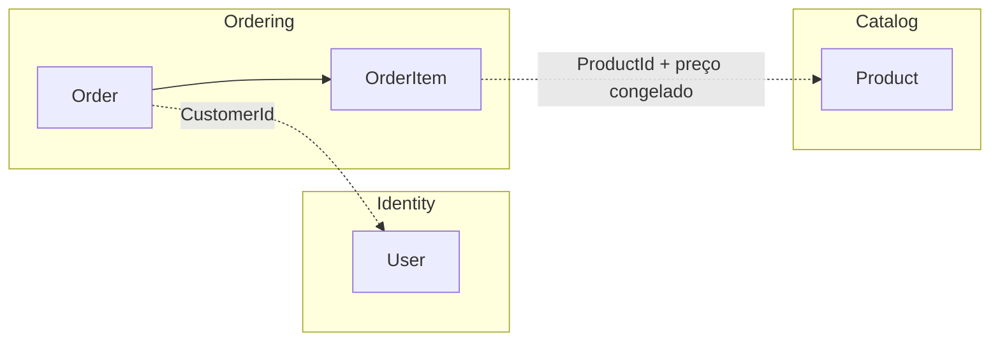

# Modelagem de domínio

Os três agregados, as invariantes que eles garantem, a máquina de estados do pedido e os eventos que ela produz.

## Agregados e fronteiras

Cada agregado referencia o outro apenas por Id, nunca por navegação de objeto — a fronteira de consistência é
explícita.

- **`User`** é quem autentica na API e também quem cria pedidos. Não existe entidade `Customer` separada
  ([ADR-004](./decisions/004-sem-entidade-customer.md)).
- **`Product`** é o que pode ser vendido. É deliberadamente anêmico
  ([ADR-008](./decisions/008-product-anemico-order-rico.md)).
- **`Order`** é a raiz do agregado de pedido e `OrderItem` é entidade filha, que só existe dentro de um pedido.
  É aqui que mora o comportamento de negócio.

## Linguagem ubíqua

| Termo | Significado |
|---|---|
| `User` | Conta que autentica na API. É também o cliente que cria pedidos. |
| `Product` | Item de catálogo, com preço unitário e quantidade disponível em estoque. |
| `Order` | Pedido de um `User`, com um ou mais itens, em uma única moeda. |
| `OrderItem` | Linha do pedido: produto, quantidade e preço unitário congelado na criação. |
| `Placed` | Pedido criado e validado. O estoque foi consultado, não reservado. Estado inicial. |
| `Confirmed` | Pedido cujo estoque foi efetivamente baixado. |
| `Canceled` | Pedido cancelado. Se estava confirmado, o estoque volta. |

## `User`

Guarda nome, e-mail, hash de senha e data de criação. O e-mail é um Value Object que valida formato e normaliza
o valor na criação.

Três pontos que definem o desenho:

- **A senha em texto puro nunca chega ao domínio.** A política de senha é validada na Application, sobre o texto
  puro, antes do hash. O domínio recebe o hash pronto e só verifica que não está vazio.
- **Verificar senha é infraestrutura**, não domínio: comparar hashes é responsabilidade do componente de hash,
  chamado pelo handler de login.
- **Não há papéis.** Nesta versão qualquer usuário autenticado gerencia o catálogo. Pedidos, porém, são sempre
  filtrados pelo `CustomerId` do token.

## `Product`

Propriedades públicas, sem métodos de negócio, sem Guards e sem eventos. O CRUD é tratado inteiramente pela
Application, com validação via FluentValidation: nome obrigatório, preço positivo, quantidade não negativa.

A baixa e a devolução de estoque **não passam por este objeto em memória** — são updates condicionais emitidos
direto pelo repositório, justamente para não vazar regra de concorrência para uma entidade que é, por decisão,
simples.

## `Order`

O agregado rico. Guarda o cliente, a moeda, o status, as datas de criação, confirmação e cancelamento, e a lista
de itens. O total é calculado a partir dos itens, não armazenado.

Os itens só podem ser construídos pelo próprio agregado — não há como montar um `OrderItem` solto e enfiá-lo na
coleção por fora. O preço unitário é **congelado** na criação: alterar o produto depois não muda o valor de um
pedido já feito.

### Invariantes garantidas na criação

| Invariante | Erro resultante |
|---|---|
| O pedido tem pelo menos um item | `order.no_items` → 400 |
| Toda quantidade é maior que zero | `order.invalid_quantity` → 400 |
| A moeda é um código ISO 4217 válido | `order.invalid_currency` → 400 |

Existência do produto e disponibilidade de estoque **não** são invariantes do pedido. São regras que cruzam
agregados e por isso vivem no handler de criação, que consulta o repositório de produtos antes de construir o
pedido — o agregado nunca depende de repositório. Produto inexistente vira uma falha de `Result`, não exception:
"existir no banco" não é algo que o pedido consiga avaliar sozinho.

### Transições

| De | Para | O que acontece |
|---|---|---|
| — | `Placed` | Itens validados, estoque consultado. Nada é reservado. |
| `Placed` | `Confirmed` | Estoque baixado. Produz o evento `OrderConfirmed`. |
| `Placed` | `Canceled` | Nada a devolver — nunca houve baixa. Nenhum evento. |
| `Confirmed` | `Canceled` | Estoque devolvido. Produz o evento `OrderCanceled`. |

Qualquer outra transição falha com `order.invalid_transition` → 409.

Dois detalhes de design valem registro:

**A transição devolve o evento em vez de acumulá-lo numa lista interna.** Não existe um `Raise()` com fila de
eventos: o método retorna exatamente o fato que aconteceu, e o handler decide publicá-lo. O tipo de retorno
torna impossível confirmar um pedido e "esquecer" de tratar a baixa de estoque. E como cancelar um pedido
`Placed` não gera efeito nenhum sobre estoque, o retorno do cancelamento é anulável — a informação está no
próprio tipo.

**O cancelamento decide sobre devolução pelo estado anterior**, não pelos itens: só um pedido que estava
confirmado teve estoque decrementado, então só ele devolve.

### Idempotência

Confirmar ou cancelar duas vezes devolve `200` nas duas chamadas, e o efeito acontece uma vez só. Mas a
idempotência mora **no handler**, não no agregado: o handler faz early return se o pedido já está no estado
alvo, enquanto o agregado, chamado diretamente num estado incompatível, lança.

A separação é deliberada. O domínio permanece estrito sobre o que é uma transição legal; o caso de uso decide
que repetir uma operação já concluída é sucesso, não erro.

Esse early return acontece dentro do lock do pedido, o que é o que impede um confirm e um cancel concorrentes de
se atropelarem — ver [`concurrency.md`](./concurrency.md).

### Eventos de domínio

Os eventos `OrderConfirmed` e `OrderCanceled` carregam o Id do pedido e a lista de ajustes de estoque
(produto + quantidade). São publicados em processo pelo mediador, **dentro da transação** aberta pelo handler.

Quem os consome vive no slice de `Products`, porque quem reage é o catálogo: um handler decrementa o estoque de
cada item, o outro devolve. O evento é o que desacopla "o pedido mudou de estado" de "o catálogo precisa ajustar
estoque" — o pedido não conhece o repositório de produtos.

Como a publicação é síncrona e transacional, uma falha no consumidor derruba a transação inteira. Não existe
janela em que o pedido fique confirmado sem a baixa correspondente.

## Estoque

| Operação | Efeito sobre o estoque |
|---|---|
| Criar pedido | Apenas consulta se há quantidade suficiente. Nada é reservado. |
| Confirmar | Decrementa, com a condição de disponibilidade dentro do próprio update. |
| Cancelar um pedido `Placed` | Nada — nunca houve baixa. |
| Cancelar um pedido `Confirmed` | Devolve as quantidades. |

A consequência aceita conscientemente: entre criar e confirmar, o estoque pode acabar. O pedido é criado com
sucesso e a confirmação falha com `409 order.insufficient_stock`. Isso é preferível a reservar estoque na
criação, o que exigiria expiração de reserva e um processo de limpeza
([ADR-005](./decisions/005-baixa-estoque-na-confirmacao.md)).

O mecanismo que garante que o estoque nunca fica negativo sob concorrência está em
[`concurrency.md`](./concurrency.md).

## Persistência

- O total do pedido **não é coluna** — é calculado a partir dos itens carregados, evitando estado duplicado que
  pode divergir.
- `OrderItem` é entidade dependente: sem `DbSet`, sem repositório, carregada junto com a raiz.
- Os Value Objects de e-mail e moeda são persistidos como coluna simples, via conversão de valor.
- A leitura não passa pelos agregados: as queries usam Dapper e projetam direto para o objeto de resposta
  ([ADR-014](./decisions/014-dapper-read-side.md)).
