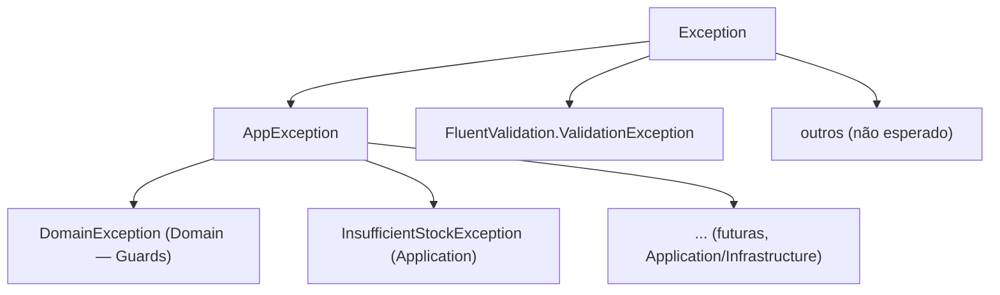

# Tratamento de erro e `ProblemDetails` — OrderFlow

> Detalhamento do ADR-011 em [`decisions.md`](./decisions.md#adr-011). Complementa o padrão
> Guard Clause + Domain Exceptions definido em [`domain-model.md`](./domain-model.md#3-shared-kernel) (ADR-007).

## 1. Objetivo

O enunciado pede, como item desejável, "fastfail e problem details em tratamentos globais". Isso significa duas
coisas concretas:

1. **Fastfail**: uma requisição inválida deve falhar o mais cedo possível — idealmente antes de tocar
   domínio/banco — em vez de falhar tarde, no meio de uma operação.
2. **Problem details**: toda resposta de erro segue o formato padrão [RFC 7807](https://www.rfc-editor.org/rfc/rfc7807)
   (`type`, `title`, `status`, `detail`, `instance` + extensões), gerado por **um único ponto** da aplicação — não
   por `try/catch` espalhado em cada endpoint.

## 2. Taxonomia de erros



| Tipo                              | Onde nasce                                   | Quando                                                             |
|------------------------------------|-----------------------------------------------|----------------------------------------------------------------------|
| `FluentValidation.ValidationException` | `ValidationBehavior` (pipeline do `Mediator`)  | Payload malformado: campo obrigatório ausente, formato inválido, `quantity <= 0` no request, etc. Roda **antes** do handler. |
| `DomainException`                 | Guards dentro do `Order`/`User` (Domain)      | Invariante de agregado violada na construção ou transição de estado (`OrderGuard.HasItems`, transição `Canceled → Confirmed`). |
| `InsufficientStockException`      | `OrderConfirmedDomainEventHandler` (Application) | Update condicional de estoque afetou 0 linhas durante a confirmação — não é invariante de agregado, é resultado de uma corrida concorrente. |
| Não tipado (`Exception` genérica) | Qualquer lugar (infra, bug, driver do banco…) | Falha inesperada — nunca deveria acontecer em operação normal.        |

`Result<T>.Failure` (usado pelos handlers para "recurso não encontrado", ver ADR-007) **não é uma exception** —
é tratado à parte, direto no endpoint (seção 5).

`OperationCanceledException` (ex.: cliente fecha a conexão/timeout do browser durante um `Confirm`/`Cancel` em
transação) também não passa pela tabela `ErrorType → status`: não é erro de servidor nem de negócio, é o cliente
indo embora. `GlobalExceptionHandler` reconhece esse caso (`httpContext.RequestAborted.IsCancellationRequested`)
e retorna `true` sem escrever `ProblemDetails` nem logar como erro — ver seção 4.

## 3. Tabela única `ErrorType` → status HTTP

Reaproveitada tanto pelo `GlobalExceptionHandler` (para `AppException`) quanto pelo mapeamento de `Result<T>` no
endpoint — definida uma única vez, em `OrderFlow.WebApi/Shared/ErrorTypeExtensions.cs`:

```csharp
public static class ErrorTypeExtensions
{
    public static int ToStatusCode(this ErrorType type) => type switch
    {
        ErrorType.Validation   => StatusCodes.Status400BadRequest,
        ErrorType.NotFound     => StatusCodes.Status404NotFound,
        ErrorType.Conflict     => StatusCodes.Status409Conflict,
        ErrorType.BusinessRule => StatusCodes.Status422UnprocessableEntity,
        _                      => StatusCodes.Status500InternalServerError
    };
}
```

| `ErrorType`     | Status HTTP                  | Exemplo                                                        |
|------------------|-------------------------------|------------------------------------------------------------------|
| `Validation`     | 400 Bad Request               | `Email` com formato inválido no registro de usuário             |
| `NotFound`       | 404 Not Found                 | `ProductId` inexistente ao criar pedido                         |
| `Conflict`       | 409 Conflict                  | `Confirm()` numa pedido `Canceled`; estoque insuficiente na confirmação |
| `BusinessRule`   | 422 Unprocessable Entity       | Regra de negócio violada sem ser conflito de estado/concorrência |

## 4. `GlobalExceptionHandler` (`IExceptionHandler`, .NET 8+)

Mecanismo nativo do ASP.NET Core — substitui middleware customizado (o `fiap-fcg-user-api` usa uma
`ExceptionMiddleware.cs` própria, padrão de .NET 6/7; aqui optamos pela API mais recente):

```csharp
public sealed class GlobalExceptionHandler(ILogger<GlobalExceptionHandler> logger) : IExceptionHandler
{
    public async ValueTask<bool> TryHandleAsync(
        HttpContext httpContext, Exception exception, CancellationToken cancellationToken)
    {
        // Cliente desconectou/cancelou a requisição — não é uma falha do servidor, e escrever
        // resposta numa conexão já encerrada é um no-op. Tratado à parte para não cair no
        // branch "500 inesperado" nem poluir os logs com LogError.
        if (exception is OperationCanceledException && httpContext.RequestAborted.IsCancellationRequested)
        {
            logger.LogInformation("Requisição cancelada pelo cliente: {TraceId}", httpContext.TraceIdentifier);
            return true;
        }

        var (statusCode, title, extensions) = exception switch
        {
            FluentValidation.ValidationException validationEx => (
                StatusCodes.Status400BadRequest,
                "One or more validation errors occurred.",
                new Dictionary<string, object?> { ["errors"] = validationEx.Errors
                    .GroupBy(e => e.PropertyName)
                    .ToDictionary(g => g.Key, g => g.Select(e => e.ErrorMessage).ToArray()) }),

            AppException appEx => (
                appEx.Type.ToStatusCode(),
                appEx.Message,
                new Dictionary<string, object?> { ["errorCode"] = appEx.Code }),

            _ => (StatusCodes.Status500InternalServerError, "An unexpected error occurred.",
                new Dictionary<string, object?>())
        };

        if (statusCode == StatusCodes.Status500InternalServerError)
            logger.LogError(exception, "Unhandled exception"); // stack completo só no log, nunca na resposta
        else
            logger.LogWarning(exception, "Handled exception: {Message}", exception.Message);

        httpContext.Response.StatusCode = statusCode;
        extensions["traceId"] = httpContext.TraceIdentifier;

        await httpContext.RequestServices.GetRequiredService<IProblemDetailsService>().WriteAsync(
            new ProblemDetailsContext
            {
                HttpContext = httpContext,
                Exception = exception,
                ProblemDetails = new ProblemDetails
                {
                    Status = statusCode,
                    Title = title,
                    Extensions = extensions!
                }
            });

        return true; // "tratado" — não deixa a exception subir mais
    }
}
```

Registro em `Program.cs`:

```csharp
builder.Services.AddProblemDetails();       // popula type/title/traceId por padrão
builder.Services.AddExceptionHandler<GlobalExceptionHandler>();
// ...
app.UseExceptionHandler();                   // sem lambda: delega pro GlobalExceptionHandler
```

## 5. `Result<T>` no endpoint (Minimal API) — sem exception

Reaproveita a mesma tabela `ErrorType → status`, via uma extensão pequena chamada pelo endpoint:

```csharp
public static IResult ToProblemResult(this Error error) =>
    Results.Problem(
        statusCode: error.Type.ToStatusCode(),
        title: error.Message,
        extensions: new Dictionary<string, object?> { ["errorCode"] = error.Code });

// no endpoint:
app.MapPost("/orders", async (PlaceOrderRequest request, ISender mediator, CancellationToken ct) =>
{
    var result = await mediator.Send(request.ToCommand(), ct);
    return result.IsSuccess
        ? Results.Created($"/orders/{result.Value!.Id}", result.Value)
        : result.Error!.ToProblemResult();
});
```

## 6. `ValidationBehavior` (pipeline do `Mediator`) — o fastfail

Mesmo padrão de pipeline behavior que o `fiap-fcg-user-api` já usa para logging
(`Fiap.FCG.User.Application/Observability/LoggingBehavior.cs`), aqui aplicado à validação — roda **antes** de
qualquer handler, então nada toca domínio/repositório se o payload já está incorreto. Usa o pacote `Mediator`
(Martin Othamar, source generator — não `MediatR`), registrado manualmente em `options.PipelineBehaviors` no
`AddMediator` (pipeline behaviors não são descobertos automaticamente por assembly scan nessa lib):

```csharp
public sealed class ValidationBehavior<TMessage, TResponse>(IEnumerable<IValidator<TMessage>> validators)
    : IPipelineBehavior<TMessage, TResponse> where TMessage : IMessage
{
    public async ValueTask<TResponse> Handle(
        TMessage message, MessageHandlerDelegate<TMessage, TResponse> next, CancellationToken cancellationToken)
    {
        if (!validators.Any())
            return await next(message, cancellationToken);

        var failures = (await Task.WhenAll(validators.Select(v => v.ValidateAsync(message, cancellationToken))))
            .SelectMany(r => r.Errors)
            .Where(f => f is not null)
            .ToList();

        if (failures.Count != 0)
            throw new FluentValidation.ValidationException(failures);

        return await next(message, cancellationToken);
    }
}
```

## 7. Exemplos de resposta

**400 — validação de payload** (`ValidationBehavior`):
```json
{
  "status": 400,
  "title": "One or more validation errors occurred.",
  "errors": { "Currency": ["Currency must be a valid 3-letter ISO code."] },
  "traceId": "00-4bf9...-01"
}
```

**409 — transição de estado inválida** (`DomainException`):
```json
{
  "status": 409,
  "title": "Cannot confirm an order in status Canceled.",
  "errorCode": "order.invalid_transition",
  "traceId": "00-4bf9...-01"
}
```

**409 — estoque insuficiente na confirmação** (`InsufficientStockException`):
```json
{
  "status": 409,
  "title": "Insufficient stock for one or more items.",
  "errorCode": "order.insufficient_stock",
  "traceId": "00-4bf9...-01"
}
```

**404 — produto não encontrado** (`Result<T>.Failure`, sem exception):
```json
{
  "status": 404,
  "title": "Product 3fa8...c1 not found.",
  "errorCode": "product.not_found",
  "traceId": "00-4bf9...-01"
}
```

**500 — inesperado** (mensagem genérica, detalhe só no log server-side):
```json
{
  "status": 500,
  "title": "An unexpected error occurred.",
  "traceId": "00-4bf9...-01"
}
```

## 8. Convenção de `Code`/`errorCode`

Formato `{aggregate}.{motivo}` em `snake_case`, minúsculo, sem espaços — legível por máquina, usado por
clientes da API para tratamento programático sem depender do texto de `title` (que pode mudar):

`order.invalid_transition`, `order.insufficient_stock`, `product.invalid_name`, `product.not_found`,
`user.invalid_email`.

## 9. Por que não usar exception para tudo (incluindo `NotFound`)

Poderíamos ter feito `IProductRepository.GetByIdAsync` lançar uma `NotFoundException` em vez do handler checar
`null` e retornar `Result.Failure`. Optamos por manter isso como `Result<T>` porque:

- É o caminho **esperado e frequente** em várias operações (`GET /orders/{id}` com Id inexistente, por exemplo),
  não uma condição excepcional — usar exception aqui é mais caro (custo de stack unwinding) sem ganhar nada em
  clareza.
- Mantém a assinatura do handler honesta: `Task<Result<OrderResponse>>` já deixa explícito, no tipo de retorno,
  que "não encontrado" é um outcome possível — quem lê o handler não precisa abrir o corpo do método pra
  descobrir isso.

`DomainException`/`InsufficientStockException` continuam sendo exception porque, nesses casos, o objetivo
específico é **abortar um fluxo em andamento** (uma transação, uma cadeia de guards dentro de um construtor) —
exatamente o cenário em que exceptions são a ferramenta certa.
