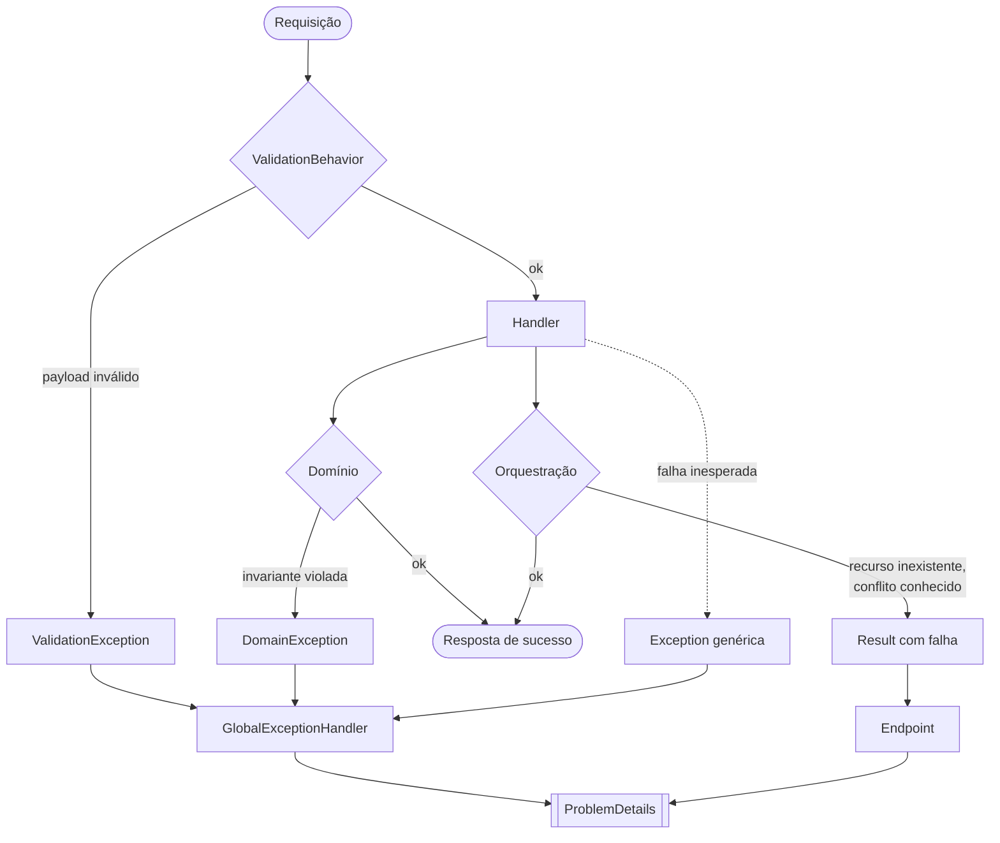

# Tratamento de erro

Como toda falha chega ao cliente em um formato único e previsível. Duas propriedades orientam o desenho:

1. **Fastfail**: uma requisição inválida falha o quanto antes, sem tocar domínio nem banco.
2. **Formato único**: toda resposta de erro segue o [`ProblemDetails` da RFC 7807](https://www.rfc-editor.org/rfc/rfc7807),
   gerado em um único ponto da aplicação. Não existe `try/catch` espalhado por endpoint.

## Os três caminhos



| Origem | Mecanismo | Quando |
|---|---|---|
| `ValidationBehavior`, no pipeline do mediador | `ValidationException` do FluentValidation | Payload malformado: campo obrigatório ausente, formato inválido, quantidade não positiva. Roda antes do handler. |
| Guards do domínio | `OrderException`, `UserException` | Invariante de agregado violada na construção ou numa transição de estado. |
| Handler do evento de estoque | `InsufficientStockException` | O update condicional não afetou nenhuma linha — resultado de corrida concorrente, não de invariante do agregado. |
| Handlers da Application | `Result<T>` com falha, sem exception | Outcome esperado: "esse Id não existe", "estoque insuficiente já na criação". |
| Qualquer lugar | Exception não tratada | Bug, falha de driver, indisponibilidade. |

Todas as exceptions de negócio herdam de `DomainException`, que carrega um código e uma classificação de erro.
Isso inclui `InsufficientStockException`, que nasce na Application: o que a base representa não é "nasci no
projeto Domain", e sim "carrego um código e um tipo que o handler global sabe traduzir".

A escolha entre exception e `Result<T>` está explicada em
[`domain-model.md`](./domain-model.md#como-o-domínio-sinaliza-falha) e
[ADR-009](./decisions/009-guard-clauses-domain-exceptions.md).

## A tabela única de status

O mapeamento de tipo de erro para status HTTP é definido **uma vez só** e usado tanto pelo handler global de
exception quanto pelo endpoint que trata um `Result` com falha. Não existe outro lugar no código que decida
status a partir de erro de negócio — mudar um status é mudar uma linha.

| Tipo | Status | Exemplo |
|---|---|---|
| `Validation` | `400` | `order.no_items`, `order.invalid_currency`, `user.invalid_email` |
| `Unauthorized` | `401` | credenciais inválidas no login |
| `NotFound` | `404` | `product.not_found`, `order.not_found` |
| `Conflict` | `409` | `order.invalid_transition`, `order.insufficient_stock` |
| `BusinessRule` | `422` | regra de negócio violada fora de conflito de estado ou concorrência |

Qualquer outra coisa vira `500`.

## O handler global

É uma implementação de `IExceptionHandler`, o mecanismo nativo do ASP.NET Core, em vez de um middleware
customizado. Ele classifica a exception numa única expressão `switch` e monta o `ProblemDetails`. Três
comportamentos valem registro:

**Requisição abortada pelo cliente não é erro.** Se o cliente desconecta durante uma confirmação em transação, o
cancelamento resultante não é falha do servidor — e escrever numa conexão encerrada não faria nada. Esse caso é
tratado antes de tudo, sem resposta e sem log de erro. A checagem é feita contra o sinal de aborto da própria
requisição, o que distingue "o cliente foi embora" de "um cancelamento interno disparou por outro motivo" — o
segundo continua caindo em `500`.

**A severidade do log é proporcional.** Um `500` é logado como erro, com o stack completo; erros esperados
(400, 404, 409) vão como aviso. Assim o alerta de produção dispara só no que é realmente anormal. Stack trace
nunca vai na resposta.

**O `traceId` está sempre presente**, em toda resposta de erro, para correlacionar o que o cliente viu com o que
o log registrou.

## O caminho sem exception

Quando o handler devolve um `Result` com falha, o endpoint converte o erro em `ProblemDetails` usando a mesma
tabela de status — sem custo de exception. Para o cliente, os dois caminhos são indistinguíveis: o payload é
igual.

## O fastfail

O `ValidationBehavior` é um pipeline behavior do mediador que roda antes de qualquer handler. Ele executa todos
os validators registrados para aquela mensagem e, havendo qualquer falha, interrompe ali — nada toca domínio nem
repositório.

Os validators são descobertos por assembly scan: criar um validator na pasta da feature basta. O behavior, esse
sim, é registrado explicitamente, porque a biblioteca de mediação não faz scan de pipeline behaviors.


## Formato da resposta

Erros de validação de payload trazem as falhas agrupadas por campo:

```json
{
  "status": 400,
  "title": "One or more validation errors occurred.",
  "errors": {
    "Currency": ["Currency must be a valid 3-letter ISO code."],
    "Items": ["The order must contain at least one item."]
  },
  "traceId": "00-4bf92f3577b34da6a3ce929d0e0e4736-00f067aa0ba902b7-01"
}
```

Os demais trazem o código de erro:

```json
{
  "status": 409,
  "title": "Não é possível transicionar o pedido de 'Canceled' para 'Confirmed'.",
  "errorCode": "order.invalid_transition",
  "traceId": "00-4bf92f3577b34da6a3ce929d0e0e4736-00f067aa0ba902b7-01"
}
```

Num `500` o título é genérico — "An unexpected error occurred." — e o detalhe fica só no log do servidor.

---

Decisão de design em [ADR-013](./decisions/013-iexceptionhandler-tabela-errortype.md).
